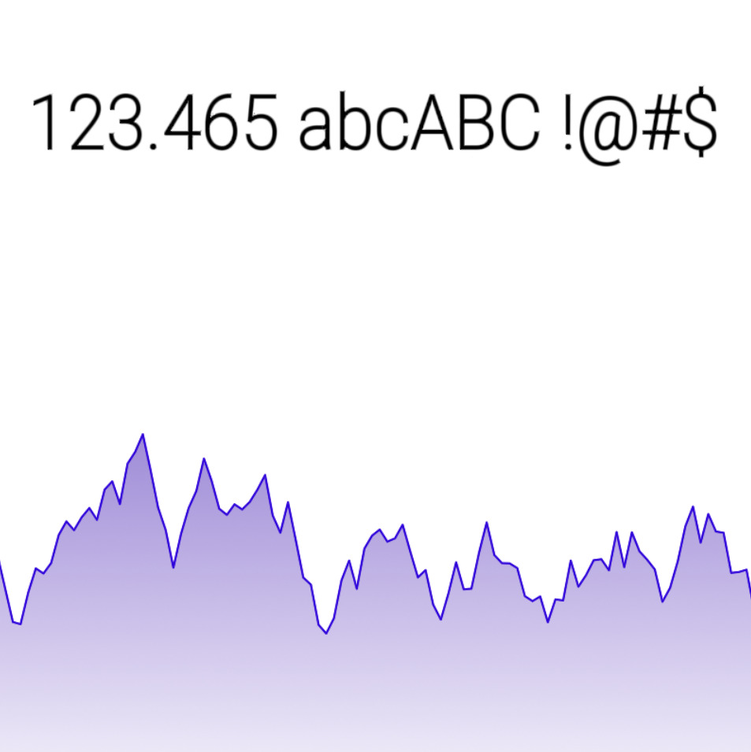

# MSDF Text and Graphics Renderer
## Overview


Custom renderer implementing graphics and text rendering from scratch in a single file - no external libraries.
## Features
- Animated Graph Shader: Renders graphs from FLOAT texture
- Text Rendering: Uses Roboto SemiCondensed ExtraLight with MTSDF atlas (generated via msdf-atlas-gen)
- Single-file implementation for simplicity

## How to Run
1. Clone the repository:
   ```bash
   git clone <repository-url>
   ```
2. Install dependencies:
   ```bash
   npm i
   ```
3. Build the project:
   ```bash
   npm run build
   ```
4. Start the application:
   ```bash
   npm run start
   ```
5. Access the application at `http://localhost:80`.